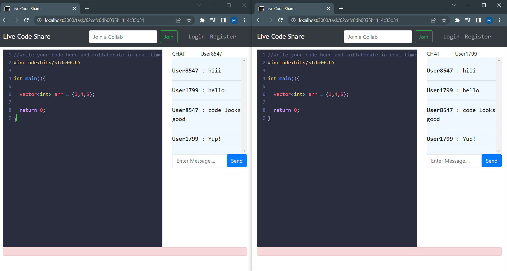

# Live Code Share
>RealTime Code collaboration platform 

Collab with your friends, colleagues and code together in realtime!. 

You can use it to `conduct interviews`, help your friend by `debuging code together`, `explaining the working of code practically` and much more. Basically it makes learning programming together much easy and fun!.

## Features :
  - User **Registration** and **Authentication.**
  - Create **Collabs** and code in realtime with anyone.

